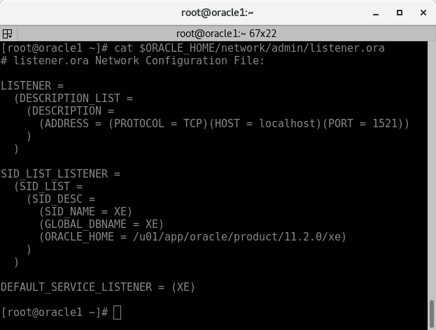
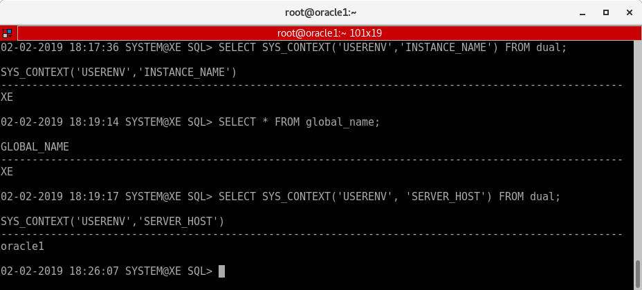

# Interconexión de Servidores de Bases de Datos

<hr class="h3">

Las interconexiones de servidores de bases de datos son operaciones que pueden ser muy útiles en diferentes contextos. Básicamente, se trata de acceder a datos que no están almacenados en nuestra base de datos, pudiendo combinarlos con los que ya tenemos.

En esta entrada veremos varias formas de crear un enlace entre distintos servidores de bases de datos.

<hr class="h3">

## Interconexión entre dos BBDD Oracle

### Entorno Vagrant

Tenemos 2 máquinas Centos con Oracle 11g XE levantadas mediante Vagrant y VirtualBox. Una la utiliaremos como "servidor" para la interconexión de datos y otra como "cliente".

* Fichero Vagrant:
``` bash
Vagrant.configure("2") do |config|

	config.vm.define "nodo1" do |nodo1|

		config.vm.provider "virtualbox" do |vb|
			vb.name = "oracle1"
			vb.memory = 2048
			vb.cpus = 1
		end

		nodo1.vm.box = "neko-neko/centos6-oracle-11g-XE"
		nodo1.vm.hostname = "oracle1"
		nodo1.vm.network "public_network",
			bridge: "wlan0", 
			use_dhcp_assigned_default_route: true

	end

	config.vm.define "nodo2" do |nodo2|

		config.vm.provider "virtualbox" do |vb|
			vb.name = "oracle2"
			vb.memory = 2048
			vb.cpus = 1
		end

		nodo2.vm.box = "neko-neko/centos6-oracle-11g-XE"
		nodo2.vm.hostname = "oracle2"
		nodo2.vm.network "public_network",
			bridge: "wlan0",
			use_dhcp_assigned_default_route: true

	end

end
```

Mi red es una `192.168.1.0`.

* Acciones iniciales en la máquina:
``` bash
sudo su -
yum -y update
yum -y install nano rlwrap
sed -ri 's/NLS_LANG=.*/NLS_LANG="SPANISH_SPAIN.AL32UTF8"/g' /etc/profile.d/oracle_env.sh
export NLS_LANG='SPANISH_SPAIN.AL32UTF8'
rlwrap sqlplus sys/vagrant as sysdba

cat <<EOF>>$ORACLE_HOME/sqlplus/admin/glogin.sql
alter session set NLS_DATE_FORMAT = 'DD-MM-YYYY HH24:mi:ss';
set sqlprompt "_DATE _USER'@'_CONNECT_IDENTIFIER 'SQL'> "
set pagesize 2000 linesize 100
set serveroutput on
EOF
```

### Fichero `listener.ora` en "servidor"

Este apartado es para el servidor de escucha.

Lo primero será modificar el fichero de configuración `listener.ora`. En este fichero podremos configurar el interlocutor de oracle(listener) el cual se encarga de aceptar peticiones remotas desde la red(TCP). Lo encontraremos en el directorio `$ORACLE_HOME/network/admin`. 

* Quedaría algo así:
``` sql
LISTENER =
	(DESCRIPTION_LIST =
		(DESCRIPTION =
			(ADDRESS = (PROTOCOL = TCP)(HOST = localhost)(PORT = 1521))
		)
	)

SID_LIST_LISTENER =
  (SID_LIST =
    (SID_DESC =
      (SID_NAME = XE)
      (GLOBAL_DBNAME = XE)
      (ORACLE_HOME = /u01/app/oracle/product/11.2.0/xe)
    )
  )

DEFAULT_SERVICE_LISTENER = (XE)
```

Lo que tenemos lo dividimos en 2 partes:

* LISTENER:
Es dónde especificamos los protocolos,IPS o nombres(HOST), puertos y etc. desde los que se podrán conectar remotamente a este servidor.

* SID_LIST_LISTENER:
Son los nombres de los servicios de escucha dónde especificamos los nombres de las instancias y directorio de las bases de datos.



* Ahora reiniciamos el servicio del listener:
``` bash
lsnrctl stop && lsnrctl start
```

* Vemos el estado del listener:
``` bash
lsnrctl status
```


* Para averiguar el `SID_NAME`, `GLOBAL_DBNAME` y el nombre del servidor:
``` sql
SELECT SYS_CONTEXT('USERENV','INSTANCE_NAME') FROM dual;

SELECT * FROM global_name;

SELECT SYS_CONTEXT('USERENV', 'SERVER_HOST') FROM dual;
```



!!! note "¿ Qué es el `SID_NAME` ?"
	Identificador del Sistema Oracle: Es un nombre único para una instancia de Oracle Database en un host concreto. El identificador del sistema Oracle (SID) ayuda a identificar el archivo de control así como a ubicar los archivos necesarios para abrir la base de datos. Suele ser el mismo que el del `GLOBAL_DBNAME`.

<hr class="h3">

### Fichero `tnsnames.ora` en "cliente"

Este apartado es para el cliente desde el cual nos conectaremos.

Primero realizaremos varias pruebas para verificar que tenemos conexión con el servidor de escucha.

* Pruebas con `tnsping`:
``` bash
tnsping 192.168.1.31
```


Como vemos el primer intento a `192.168.1.31`(Servidor de escucha) tiene éxito, pero intentamos realizar esta operación a una IP inexistente y da error.

* Pruebas de conexión con `sqlplus`:
``` bash
rlwrap sqlplus system/vagrant@//192.168.1.31:1521/XE
```


Podemos ver que estamos conectado al servidor de escucha con nombre "oracle1".

Ahora para realizar la interconexión del servidor necesitamos configurar el fichero `tnsnames.ora`. En este fichero podemos configurar y "mapear" los nombres de los servicios que está escuchando el servidor. Lo encontraremos en el directorio `$ORACLE_HOME/network/admin`. 

* Quedaría algo así:
``` sql
tns_ora1 =
  (DESCRIPTION =
    (ADDRESS = (PROTOCOL = TCP)(HOST = 192.168.1.31)(PORT = 1521))
    (CONNECT_DATA =
      (SERVER = DEDICATED)
      (SERVICE_NAME = XE)
    )
  )

```


* Volvemos a realizar una prueba con `tnsping` pero esta vez usando el nombre especificado:
``` bash
tnsping tna_ora1
```


Como vemos el primer intento a "tns_ora1"(Servidor de escucha) tiene éxito, pero intentamos realizar esta operación a un nombre no configurado y da error.

<hr class="h3">

### Configuración de interconexión mediante enlace de base de datos

Ahora necesitamos configurar dicho enlace en el cliente desde "sqlplus".

* Configuración enlace:
``` sql
CREATE DATABASE LINK link_ora1
CONNECT TO scott
IDENTIFIED BY tiger
USING 'tns_ora1';
```

SELECT *
FROM scott.dept@link_ora1;


<hr class="h3">


## Interconexión entre dos BBDD Postgres

## Interconexión entre BBDD Oracle y Postgres(o MariaDB) con Heterogeneus Services


Creación squema scott:

CREATE USER SCOTT IDENTIFIED BY tiger DEFAULT TABLESPACE USERS TEMPORARY TABLESPACE TEMP PROFILE DEFAULT;

GRANT CONNECT, RESOURCE TO SCOTT;

ALTER USER SCOTT ACCOUNT UNLOCK;

CREATE TABLE SCOTT.DEPT
(
 DEPTNO NUMBER(2),
 DNAME VARCHAR2(14),
 LOC VARCHAR2(13),
 CONSTRAINT PK_DEPT PRIMARY KEY (DEPTNO)
);


INSERT INTO SCOTT.DEPT VALUES (10, 'ACCOUNTING', 'NEW YORK');
INSERT INTO SCOTT.DEPT VALUES (20, 'RESEARCH', 'DALLAS');
INSERT INTO SCOTT.DEPT VALUES (30, 'SALES', 'CHICAGO');
INSERT INTO SCOTT.DEPT VALUES (40, 'OPERATIONS', 'BOSTON');


COMMIT;


conn scott/tiger


CREATE USER SCOTT IDENTIFIED BY tiger DEFAULT TABLESPACE USERS TEMPORARY TABLESPACE TEMP PROFILE DEFAULT;

GRANT CONNECT, RESOURCE TO SCOTT;

ALTER USER SCOTT ACCOUNT UNLOCK;

CREATE TABLE SCOTT.EMP
(
 EMPNO NUMBER(4),
 ENAME VARCHAR2(10),
 JOB VARCHAR2(9),
 MGR NUMBER(4),
 HIREDATE DATE,
 SAL NUMBER(7, 2),
 COMM NUMBER(7, 2),
 DEPTNO NUMBER(2),
 CONSTRAINT FK_DEPTNO FOREIGN KEY (DEPTNO) REFERENCES SCOTT.DEPT (DEPTNO),
 CONSTRAINT PK_EMP PRIMARY KEY (EMPNO)
);

INSERT INTO SCOTT.EMP VALUES(7369,'SMITH','CLERK',7902,TO_DATE('17-DIC-1980','DD-MON-YYYY'),800,NULL,20);
INSERT INTO SCOTT.EMP VALUES(7499,'ALLEN','SALESMAN',7698,TO_DATE('20-FEB-1981','DD-MON-YYYY'),1600,300,30);
INSERT INTO SCOTT.EMP VALUES(7521,'WARD','SALESMAN',7698,TO_DATE('22-FEB-1981','DD-MON-YYYY'),1250,500,30);
INSERT INTO SCOTT.EMP VALUES(7566,'JONES','MANAGER',7839,TO_DATE('2-ABR-1981','DD-MON-YYYY'),2975,NULL,20);
INSERT INTO SCOTT.EMP VALUES(7654,'MARTIN','SALESMAN',7698,TO_DATE('28-SEP-1981','DD-MON-YYYY'),1250,1400,30);
INSERT INTO SCOTT.EMP VALUES(7698,'BLAKE','MANAGER',7839,TO_DATE('1-MAY-1981','DD-MON-YYYY'),2850,NULL,30);
INSERT INTO SCOTT.EMP VALUES(7782,'CLARK','MANAGER',7839,TO_DATE('9-JUN-1981','DD-MON-YYYY'),2450,NULL,10);
INSERT INTO SCOTT.EMP VALUES(7788,'SCOTT','ANALYST',7566,TO_DATE('09-DIC-1982','DD-MON-YYYY'),3000,NULL,20);
INSERT INTO SCOTT.EMP VALUES(7839,'KING','PRESIDENT',NULL,TO_DATE('17-NOV-1981','DD-MON-YYYY'),5000,NULL,10);
INSERT INTO SCOTT.EMP VALUES(7844,'TURNER','SALESMAN',7698,TO_DATE('8-SEP-1981','DD-MON-YYYY'),1500,0,30);
INSERT INTO SCOTT.EMP VALUES(7876,'ADAMS','CLERK',7788,TO_DATE('12-ENE-1983','DD-MON-YYYY'),1100,NULL,20);
INSERT INTO SCOTT.EMP VALUES(7900,'JAMES','CLERK',7698,TO_DATE('3-DIC-1981','DD-MON-YYYY'),950,NULL,30);
INSERT INTO SCOTT.EMP VALUES(7902,'FORD','ANALYST',7566,TO_DATE('3-DIC-1981','DD-MON-YYYY'),3000,NULL,20);
INSERT INTO SCOTT.EMP VALUES(7934,'MILLER','CLERK',7782,TO_DATE('23-ENE-1982','DD-MON-YYYY'),1300,NULL,10);

COMMIT;

