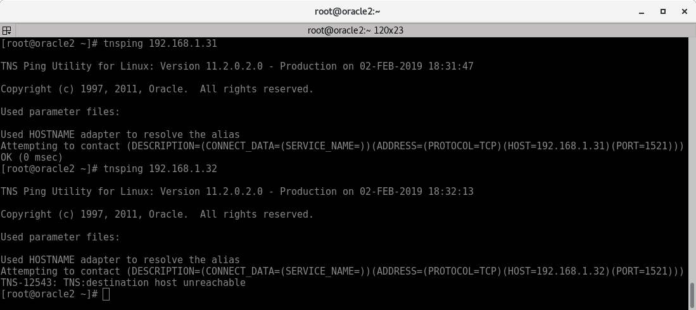
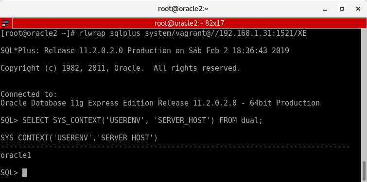
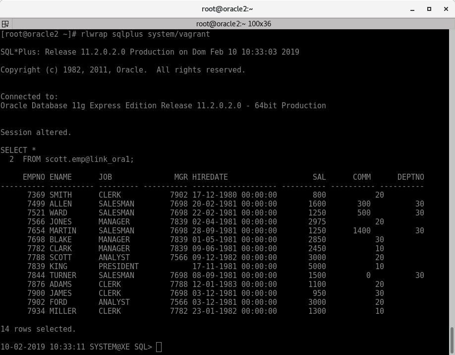
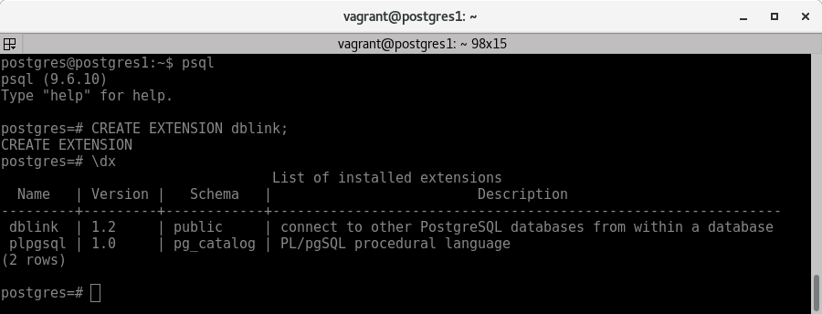
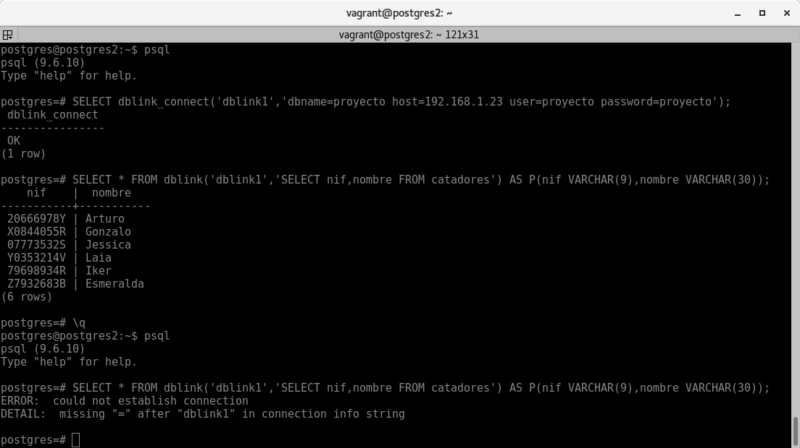
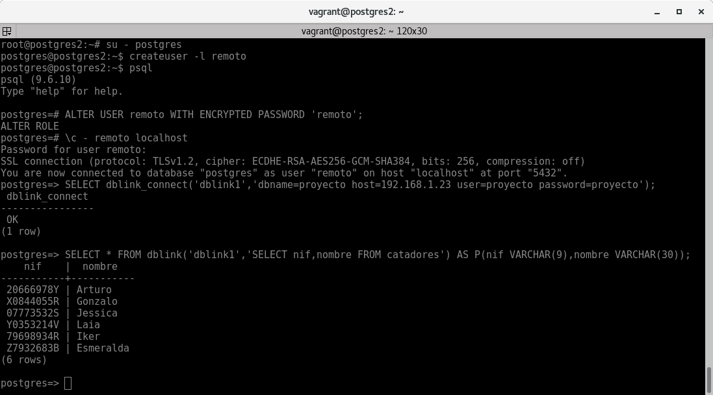
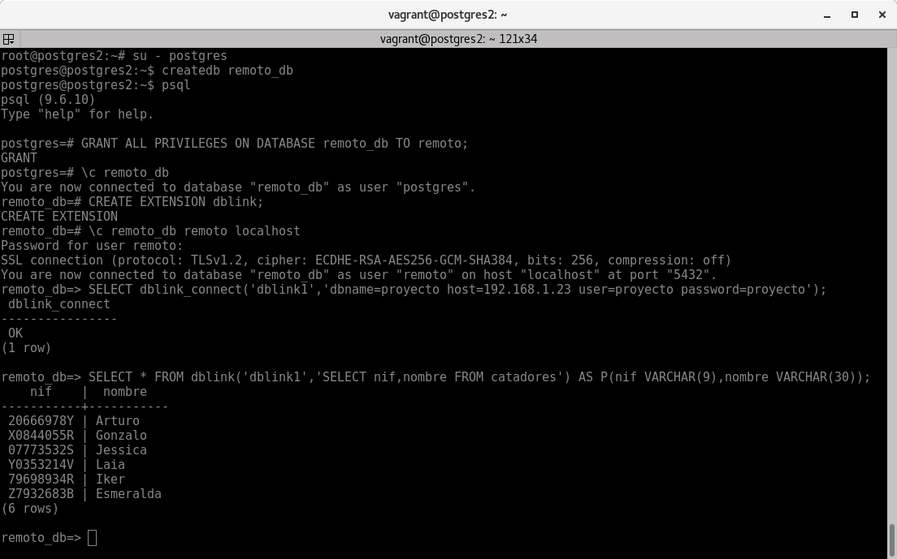
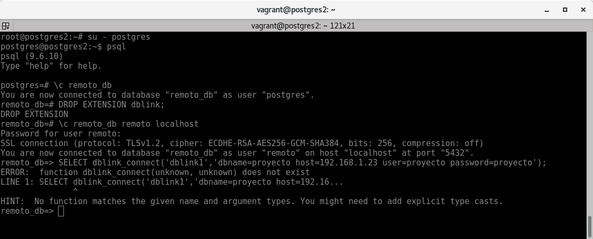

# Interconexión de Servidores de Bases de Datos

<hr class="h3">

Las interconexiones de servidores de bases de datos son operaciones que pueden ser muy útiles en diferentes contextos. Básicamente, se trata de acceder a datos que no están almacenados en nuestra base de datos, pudiendo combinarlos con los que ya tenemos.

En esta entrada veremos varias formas de crear un enlace entre distintos servidores de bases de datos.

<hr class="h3">

## Interconexión entre dos BBDD Oracle

### Entorno Vagrant

Tenemos 2 máquinas Centos con Oracle 11g XE levantadas mediante Vagrant y VirtualBox. Una la utiliaremos como "servidor" para la interconexión de datos y otra como "cliente".

* Fichero Vagrant:
``` bash
Vagrant.configure("2") do |config|

    config.vm.define "nodo1" do |nodo1|

        config.vm.provider "virtualbox" do |vb|
            vb.name = "oracle1"
            vb.memory = 2048
            vb.cpus = 1
        end

        nodo1.vm.box = "neko-neko/centos6-oracle-11g-XE"
        nodo1.vm.hostname = "oracle1"
        nodo1.vm.network "public_network",
            bridge: "wlan0", 
            use_dhcp_assigned_default_route: true

    end

    config.vm.define "nodo2" do |nodo2|

        config.vm.provider "virtualbox" do |vb|
            vb.name = "oracle2"
            vb.memory = 2048
            vb.cpus = 1
        end

        nodo2.vm.box = "neko-neko/centos6-oracle-11g-XE"
        nodo2.vm.hostname = "oracle2"
        nodo2.vm.network "public_network",
            bridge: "wlan0",
            use_dhcp_assigned_default_route: true

    end

end
```

Mi red es una `192.168.1.0`.

* Acciones iniciales en la máquina:
``` bash
sudo su -
yum -y update
yum -y install nano rlwrap
sed -ri 's/NLS_LANG=.*/NLS_LANG="SPANISH_SPAIN.AL32UTF8"/g' /etc/profile.d/oracle_env.sh
export NLS_LANG='SPANISH_SPAIN.AL32UTF8'
rlwrap sqlplus sys/vagrant as sysdba

cat <<EOF>>$ORACLE_HOME/sqlplus/admin/glogin.sql
alter session set NLS_DATE_FORMAT = 'DD-MM-YYYY HH24:mi:ss';
set sqlprompt "_DATE _USER'@'_CONNECT_IDENTIFIER 'SQL'> "
set pagesize 2000 linesize 100
set serveroutput on
EOF
```

### Fichero `listener.ora` en "servidor"

Este apartado es para el servidor de escucha.

Lo primero será modificar el fichero de configuración `listener.ora`. En este fichero podremos configurar el interlocutor de oracle(listener) el cual se encarga de aceptar peticiones remotas desde la red(TCP). Lo encontraremos en el directorio `$ORACLE_HOME/network/admin`. 

* Quedaría algo así:
``` sql
LISTENER =
    (DESCRIPTION_LIST =
        (DESCRIPTION =
            (ADDRESS = (PROTOCOL = TCP)(HOST = localhost)(PORT = 1521))
        )
    )

SID_LIST_LISTENER =
  (SID_LIST =
    (SID_DESC =
      (SID_NAME = XE)
      (GLOBAL_DBNAME = XE)
      (ORACLE_HOME = /u01/app/oracle/product/11.2.0/xe)
    )
  )

DEFAULT_SERVICE_LISTENER = (XE)
```
!!! note ""
    * LISTENER:  
    Es dónde especificamos los protocolos,IPs o nombres(HOST), puertos y etc. desde los que se podrán conectar remotamente a este servidor.  
    Al especificar "localhost", se podrá conectar cualquiera que tenga acceso a la red de la máquina. Si por ejemplo usaramos en vez de "localhost" usaramos "192.168.1.31", sólo podrán acceder los que tengan acceso a la red "192.168.1.0/24".  

    * SID_LIST_LISTENER:  
    Son los nombres de los servicios de escucha dónde especificamos los nombres de las instancias y directorio de las bases de datos. (SID_NAME,GLOBAL_DBNAME,ORACLE_HOME)

    * DEFAULT_SERVICE_LISTENER:  
    Por defecto el servicio de escucha se llama "XE".


* Ahora reiniciamos el servicio del listener:
``` bash
lsnrctl stop && lsnrctl start
```

* Vemos el estado del listener:
``` bash
lsnrctl status
```


* Para averiguar el `SID_NAME`, `GLOBAL_DBNAME` y el nombre del servidor:
``` sql
SELECT SYS_CONTEXT('USERENV','INSTANCE_NAME') FROM dual;

SELECT * FROM global_name;

SELECT SYS_CONTEXT('USERENV', 'SERVER_HOST') FROM dual;
```


!!! note "¿ Qué es el `SID_NAME` ?"
    Identificador del Sistema Oracle: Es un nombre único para una instancia de Oracle Database en un host concreto. El identificador del sistema Oracle (SID) ayuda a identificar el archivo de control así como a ubicar los archivos necesarios para abrir la base de datos. Suele ser el mismo que el del `GLOBAL_DBNAME`.

<hr class="h3">

### Fichero `tnsnames.ora` en "cliente"

Este apartado es para el cliente desde el cual nos conectaremos.

Primero realizaremos varias pruebas para verificar que tenemos conexión con el servidor de escucha.

* Pruebas con `tnsping`:
``` bash
tnsping 192.168.1.31
```



Como vemos el primer intento a `192.168.1.31`(Servidor de escucha) tiene éxito, pero intentamos realizar esta operación a una IP inexistente y da error.

* Pruebas de conexión con `sqlplus`:
``` bash
rlwrap sqlplus system/vagrant@//192.168.1.31:1521/XE
```



Podemos ver que estamos conectado al servidor de escucha con nombre "oracle1".

Ahora para realizar la interconexión del servidor necesitamos configurar el fichero `tnsnames.ora`. En este fichero podemos configurar y "mapear" los nombres de los servicios que está escuchando el servidor. Lo encontraremos en el directorio `$ORACLE_HOME/network/admin`. 

* Quedaría algo así:
``` sql
tns_ora1 =
  (DESCRIPTION =
    (ADDRESS = (PROTOCOL = TCP)(HOST = 192.168.1.31)(PORT = 1521))
    (CONNECT_DATA =
      (SERVER = DEDICATED)
      (SERVICE_NAME = XE)
    )
  )

```

!!! note ""
    * ADDRESS:  
    Especificamos el protocolo, IP o nombre y puerto de la máquina a la que queremos conectarnos.
    * SERVICE_NAME:  
    Nombre del servicio de la base de datos a la que nos conectaremos.


* Volvemos a realizar una prueba con `tnsping` pero esta vez usando el nombre especificado:
``` bash
tnsping tna_ora1
```


Como vemos el primer intento a "tns_ora1"(Servidor de escucha) tiene éxito, pero intentamos realizar esta operación a un nombre no configurado y da error.

<hr class="h3">

### Configuración de interconexión mediante enlace de base de datos

Ahora necesitamos configurar dicho enlace en el cliente desde "sqlplus".

* Configuración enlace:
``` sql
CREATE DATABASE LINK link_ora1
CONNECT TO scott
IDENTIFIED BY tiger
USING 'tns_ora1';
```

!!! note ""
    * LINK:  
    Nombre que llamaremos al enlace de base dedatos para luego utilizarlo en las consultas, etc..  

    * CONNECT TO:  
    Usuario con el que nos conectaremos a la base de datos de "oracle1"

    * USING:  
    Nombre del "mapeo" establecido en `tnsnames.ora`.

* Consulta a la base de datos de "oracle1" desde "oracle2":
``` sql
SELECT *
FROM scott.emp@link_ora1;
```




<hr class="h2">


## Interconexión entre dos BBDD Postgres

### Escenario vagrant

Ya que el escenario anterior eran de máquinas Centos 6 (2016), ahora utilizaremos otro escenario con máquinas Debian Stretch para la interconexión de 2 base de datos postgres.

* Fichero vagrant:
``` bash
Vagrant.configure("2") do |config|

  config.vm.define "nodo3" do |nodo3|

    config.vm.provider "virtualbox" do |vb|
      vb.name = "postres1"
      vb.cpus = 1
    end

    nodo3.vm.box = "debian/stretch64"
    nodo3.vm.hostname = "postgres1"
    nodo3.vm.network "public_network",
      bridge: "wlan0",
      use_dhcp_assigned_default_route: true

  end

  config.vm.define "nodo4" do |nodo4|

    config.vm.provider "virtualbox" do |vb|
      vb.name = "postres2"
      vb.cpus = 1
    end

    nodo4.vm.box = "debian/stretch64"
    nodo4.vm.hostname = "postres2"
    nodo4.vm.network "public_network",
      bridge: "wlan0",
      use_dhcp_assigned_default_route: true

  end

end
```

<hr class="h3">

### Instalación y configuración de Postgres para acceso remoto

Las siguientes acciones las realizaremos en el servidor de escucha "postgres1".

* Instalación postgres:
``` bash
apt update && apt -y upgrade && apt -y install postgresql-9.6
```


* Configuramos postgres para que accepte conexiones desde una ip(red):
``` bash
sed -ri "s/.*listen_addresses.*/listen_addresses = \'192.168.1.23, localhost\'/g" /etc/postgresql/9.6/main/postgresql.conf
```

!!! note ""
    La ip especificada es la de la propia máquina que estamos configurando.

    Con esto podemos conectarnos a ese servidor en local y desde la red "192.168.1/24".

* Reiniciamos Postgres para realizar los cambios:
``` bash
systemctl restart postgresql.service
```


* Configuramos la autenticación del cliente:
``` bash hl_lines="10"
echo '''
# TYPE  DATABASE        USER            ADDRESS                 METHOD
local   all             postgres                                peer

# "local" is for Unix domain socket connections only
local   all             all                                     peer

# IPv4 local connections:
host    all             all             127.0.0.1/32            md5
host    all             all             192.168.1.31/24         md5 

# IPv6 local connections:
host    all             all             ::1/128                 md5

''' > /etc/postgresql/9.6/main/pg_hba.conf
```

!!! note ""
    La línea señalada es la que añadimos. Con esto permitimos autenticaciones para la máquina con IP "192.168.1.31" y con el método "md5" que es el de por defecto de los usuarios de la base de datos.  
    `peer` es la autenticación mediante usuarios del sistema con el que estemos logueados.


* Reiniciamos Postgres para realizar los cambios:
``` bash
systemctl restart postgresql.service
```

<hr class="h3">

### Habilitamos extensión `dblink`

Esto lo realizamos en el servidor desde el cual realizaremos las consultas.

* Creación de extensión:
``` bash
CREATE EXTENSION dblink;
```



!!! note ""
    * Desde Postgresql 9.1 en adelante algunas extensiones se pueden habilitar de forma simple con:  
    `CREATE EXTENSION`
    * Por defecto la extensión se crea en el "schema public", si queremos crearlo en otro schema:  
    `CREATE EXTENSION dblink SCHEMA schemaprueba`  
    Teniendo que estar ya creado dicho "schema".
    * Solo los superusuarios de postgres pueden crear extensiones.

<hr class="h3">

### Prueba de acceso a otra base de datos en local

* Creamos una base de datos para pruebas:
``` sql
su - postgres
createdb proyecto
createuser -l proyecto
psql

ALTER USER proyecto WITH ENCRYPTED PASSWORD 'proyecto';

GRANT ALL PRIVILEGES ON DATABASE proyecto TO proyecto;

-- DBNAME   USER     HOST       PORT
\c proyecto proyecto localhost

CREATE TABLE catadores
(
    nif VARCHAR(9),
    nombre VARCHAR(30),
    apellidos VARCHAR(40),
    direccion VARCHAR(60),
    telefono VARCHAR(9),
    CONSTRAINT PK_catadores PRIMARY KEY (nif),
    CONSTRAINT CC_catadores_tel UNIQUE(telefono),
    CONSTRAINT CK_catadores_nif CHECK ( nif ~ '^((\d){8})[A-Z]$|^([KLMXYZ](\d){7})[A-Z]$' )
);

INSERT INTO catadores(nif,nombre,apellidos,direccion,telefono) VALUES
('20666978Y','Arturo','Valle Segura','Rambla Mayor 34','702942135'),
('X0844055R','Gonzalo','Rubio Catalan','Pasaje Real 21','702701555'),
('07773532S','Jessica','Martos Arranz','Cuesta Iglesia, Portal 1, 2ºB','602858378'),
('Y0353214V','Laia','Palomo Robles','Cuesta Pedralbes 87','703571606'),
('79698934R','Iker','Gallardo Merino','Vereda Real, Portal 3, Escalera 8','708796631'),
('Z7932683B','Esmeralda','Benitez Alonso','Ronda Iglesia 138','601949104');
```

* Consultamos a la base de datos de "proyecto" desde el usuario y base de datos "postgres":
``` sql
SELECT * FROM dblink('dbname=proyecto','SELECT nif,nombre FROM catadores') AS P(nif VARCHAR(9),nombre VARCHAR(30));
```


!!! note ""
    * Especificamos nombre de base de datos.
    * Especificamos "SELECT" a relizar.
    * Es obligatorio definir el tipo de registro de las columnas a consultar (El tamaño no es obligatorio).

<hr class="h3">

### Prueba de acceso a otra base de datos en remoto

Teniendo configurado la primera máquina para escuche remotamente y habiendo ya creado la extension en la máquina segunda, procedemos con lo siguiente.

* Podemos crear una conexión persistente con la base de datos remota y así no tener que especificar los datos de conexión:
``` sql
SELECT dblink_connect('dblink1','dbname=proyecto host=192.168.1.23 user=proyecto password=proyecto');
```

* Realizamos consulta remota:
``` sql
SELECT * FROM dblink('dblink1','SELECT nif,nombre FROM catadores') AS P(nif VARCHAR(9),nombre VARCHAR(30));
```

!!! note ""
    * Al cerrar la sesión se finalizan las conexiones persistentes.



Para conexiones con usuarios no privilegiados relizamos lo siguiente.

* Creación usuario nuevo:
``` sql
su - postgres
createuser -l remoto
psql

ALTER USER remoto WITH ENCRYPTED PASSWORD 'remoto';

-- ACTUAL DATABASE (-)
\c - remoto localhost
```

* Consultamos a la base de datos de "proyecto" del servidor de escucha desde un usuario nuevo en el servidor 2:
``` sql
SELECT dblink_connect('dblink1','dbname=proyecto host=192.168.1.23 user=proyecto password=proyecto');

SELECT * FROM dblink('dblink1','SELECT nif,nombre FROM catadores') AS P(nif VARCHAR(9),nombre VARCHAR(30));
```




En el caso de que queramos realizar consultas remotas desde las bases de datos de usuarios no privilegiados tendremos que crear la extensión "dblink" en su base de datos.

* Creación extensión en base de datos de usuario remoto:
``` sql
su - postgres
createdb remoto_db
psql

GRANT ALL PRIVILEGES ON DATABASE remoto_db TO remoto;

\c remoto_db

CREATE EXTENSION dblink;

\c remoto_db remoto localhost
```

* Realizamos consulta:
``` sql
SELECT dblink_connect('dblink1','dbname=proyecto host=192.168.1.23 user=proyecto password=proyecto');

SELECT * FROM dblink('dblink1','SELECT nif,nombre FROM catadores') AS P(nif VARCHAR(9),nombre VARCHAR(30));
```




* Podemos ver un ejemplo de que si no tenemos creada la extensión en la base de datos de remoto no funciona:
``` sql
su - postgres
psql
\c remoto_db

DROP EXTENSION dblink;

\c remoto_db remoto localhost

SELECT dblink_connect('dblink1','dbname=proyecto host=192.168.1.23 user=proyecto password=proyecto');
```



Nos dice que no encuentra la función "dblink".


!!! info "info"
    Mas información acerca de la extensión "dblink":
    [Postgres dblink](https://www.postgresql.org/docs/9.6/dblink.html)

<hr class="h2">

## Interconexión entre BBDD Oracle y Postgres(o MariaDB) con Heterogeneus Services

