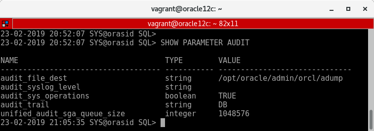
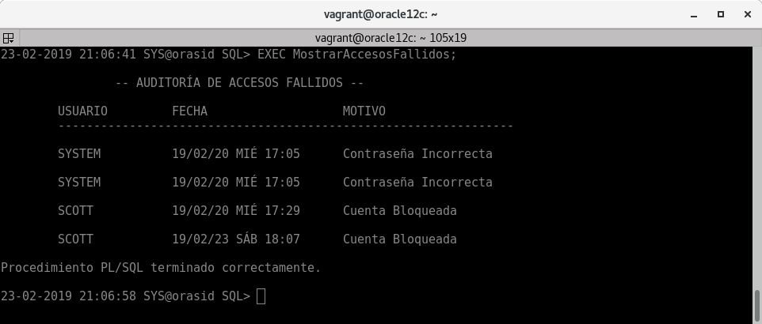
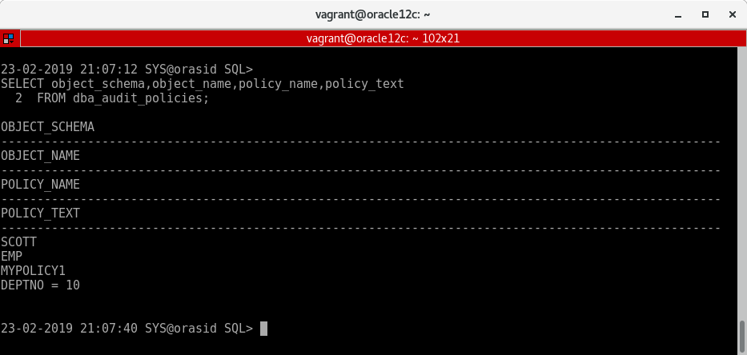
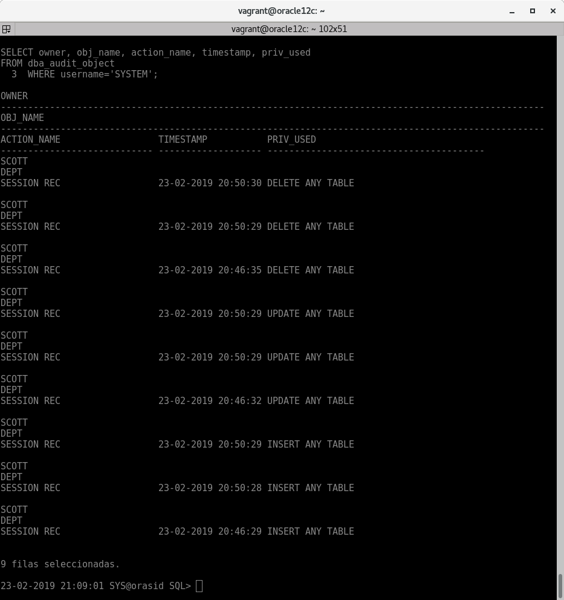

# AUDITORÍAS EN BASE DE DATOS

<hr class="h3">

Las interconexiones de servidores de bases de datos son operaciones que pueden ser muy útiles en diferentes contextos. Básicamente, se trata de acceder a datos que no están almacenados en nuestra base de datos, pudiendo combinarlos con los que ya tenemos.

En esta entrada veremos varias formas de crear un enlace entre distintos servidores de bases de datos.

<hr class="h3">

## 1 -->
### Activa desde SQLPlus la auditoría de los intentos de acceso fallidos al sistema. Comprueba su funcionamiento.

* Podemos ver los parámetros de auditoría de Oracle con:
``` sql
SHOW PARAMETER AUDIT
```



* En el caso que "audit_trail" estuviera en modo "none" para activarlo sería:
``` sql
ALTER SYSTEM SET audit_trail=db scope=spfile;
```

!!! note ""
	* "db" es para que se guarden los registros de las auditorías en la base de datos.
	* "os" es para que se guarden los registros de las auditorías en el sistema.
	* "none" es para deshabilitar las auditorías.

* Para que se ejecuten los cambios necesitamos reiniciar la instancia de la base de datos:
``` sql
SHUTDOWN

STARTUP
```

* Para activar una auditoría que compruebe los intentos fallidos al sistema:
``` sql
AUDIT CREATE SESSION WHENEVER NOT SUCCESSFUL;
```

* Para ver las auditorías activas:
``` sql
SELECT * FROM dba_priv_audit_opts;
```


Realizamos algunos intentos de acceso fallidos. Los intentos los realizamos estando dentro de sqlplus, si lo realizamos fuera de sqlplus no se auditan los intentos fallidos.

* Ejemplo:
``` sql
sqlplus> CONN system/asdfafh

##no estando en el sistema:##

# sqlplus system/aasdfa
```

* Ahora vemos los intentos fallidos en "dba_audit_session":
``` sql
SELECT os_username,username,extended_timestamp,action_name,returncode
FROM dba_audit_session;
```


!!! note ""
	No se pueden auditar las acciones del ususario "SYS".
	


* Si queremos descativar la auditoría:
``` sql
NOAUDIT CREATE SESSION WHENEVER NOT SUCCESSFUL;
```

<hr class="h3">

## 2 -->
### Realiza un procedimiento en PL/SQL que te muestre los accesos fallidos junto con el motivo de los mismos, transformando el código de error almacenado en un mensaje de texto comprensible.

* Función para devolver motivo del error:
``` sql
CREATE OR REPLACE FUNCTION DevolverMotivo
(
	p_error NUMBER
)
RETURN VARCHAR2
IS
	mensaje VARCHAR2(25);
BEGIN
	CASE p_error
		WHEN 1017 THEN 
			mensaje:='Contraseña Incorrecta';
		WHEN 28000 THEN
			mensaje:='Cuenta Bloqueada';
		ELSE
			mensaje:='Error Desconocido';
	END CASE;
RETURN mensaje;
END DevolverMotivo;
/
```

* Procedmiento "Padre":
``` sql
CREATE OR REPLACE PROCEDURE MostrarAccesosFallidos
IS
	CURSOR c_accesos
	IS 
	SELECT username, returncode, timestamp
	FROM dba_audit_session 
	WHERE action_name='LOGON' 
	AND returncode != 0 
	ORDER BY timestamp;

	v_motivo VARCHAR2(25);
BEGIN
	DBMS_OUTPUT.PUT_LINE(CHR(10)||CHR(9)||CHR(9)||'-- AUDITORÍA DE ACCESOS FALLIDOS --');
	DBMS_OUTPUT.PUT_LINE(CHR(10)||CHR(9)||'USUARIO'||CHR(9)||CHR(9)||'FECHA'||CHR(9)||CHR(9)||CHR(9)||
		'MOTIVO');
	DBMS_OUTPUT.PUT_LINE(CHR(9)||'----------------------------------------------------------------');
	FOR acceso IN c_accesos LOOP
		v_motivo:=DevolverMotivo(acceso.returncode);
		DBMS_OUTPUT.PUT_LINE(CHR(10)||CHR(9)||acceso.username||CHR(9)||CHR(9)||
			TO_CHAR(acceso.timestamp,'YY/MM/DD DY HH24:MI')||CHR(9)||v_motivo);
	END LOOP; 
END MostrarAccesosFallidos;
/
```

* Ejecutamos procedmiento:
``` sql
EXEC MostrarAccesosFallidos;
```



<hr class="h3">

## 3 -->
### Activa la auditoría de las operaciones DML realizadas por SCOTT. Comprueba su funcionamiento.

* Activamos la auditoría:
``` sql
AUDIT INSERT TABLE, UPDATE TABLE, DELETE TABLE BY SCOTT BY ACCESS;
```

!!! note ""
	* BY ACCESS : Realiza un registro por cada acción.
	* BY SESSION : Realiza un registro de todas las acciones por cada sesión iniciada.

* Realizamos pruebas:
``` sql
CONN SCOTT/TIGER

INSERT INTO dept VALUES(50,'RRHH','Dos Hermanas');

UPDATE dept SET loc='Utrera' WHERE deptno=50;

DELETE FROM dept WHERE deptno=50;

COMMIT;
```

* Para ver las acciones DML realizadas por el usuario SCOTT:
``` sql
SELECT obj_name, action_name, timestamp
FROM dba_audit_object
WHERE username='SCOTT';
```


## 4 -->
### Realiza una auditoría de grano fino para almacenar información sobre la inserción de empleados del departamento 10 en la tabla emp de scott.

* Crear auditoría de grano fino:
``` sql
BEGIN
	DBMS_FGA.ADD_POLICY (
    	object_schema      =>  'SCOTT',
    	object_name        =>  'EMP',
    	policy_name        =>  'mypolicy1',
    	audit_condition    =>  'DEPTNO = 10',
    	statement_types    =>  'INSERT'
    );
END;
/
```

* Ver políticas creadas:
``` sql
SELECT object_schema,object_name,policy_name,policy_text
FROM dba_audit_policies;
```



* Realizamos pruebas:
``` sql
CONN SCOTT/TIGER

INSERT INTO emp VALUES(7950,'JUANPE','JEFE',null,sysdate,9999,9999,10);
INSERT INTO emp VALUES(7951,'RAUL','PROFE',null,sysdate,9999,9999,10);

COMMIT;
```

* Para ver las acciones realizadas con las políticas establecidas anteriormente:
``` sql
SELECT sql_text
FROM dba_fga_audit_trail
WHERE policy_name='MYPOLICY1';
```


* Eliminar auditoría de grano fino:
``` sql
BEGIN
	DBMS_FGA.DROP_POLICY (
    	object_schema      =>  'SCOTT',
    	object_name        =>  'EMP',
    	policy_name        =>  'mypolicy1'    	
    );
END;
/
```

[manual Fine-Grained Auditing](https://www.oracle.com/technetwork/articles/idm/fga-otn-082646.html)

[manual DBMS_FGA](https://docs.oracle.com/database/121/ARPLS/d_fga.htm)

## 5 -->
### Explica la diferencia entre auditar una operación by access o by session.

La diferencia es que "by access" realiza un registro por cada sentencia auditada y "by session" agrupa las sentencias por tipo en un registro por cada sesión iniciada.

!!! attention ""
	A partir de Oracle 12 estas 2 formas son mas parecidas.

Anteriormente ya realizamos un ejemplo de "by access", ahora realizaremos un ejemplo de "by session".

* Activamos la auditoría:
``` sql
AUDIT INSERT TABLE, UPDATE TABLE, DELETE TABLE BY SYSTEM BY SESSION;
```

* Realizamos pruebas(repetimos varias veces):
``` sql
CONN SYSTEM

INSERT INTO SCOTT.dept VALUES(50,'RRHH','Dos Hermanas');

UPDATE SCOTT.dept SET loc='Utrera' WHERE deptno=50;

DELETE FROM SCOTT.dept WHERE deptno=50;

COMMIT;
```

* Comparamos los 2 tipos de registros:
``` sql
SELECT owner, obj_name, action_name, timestamp, priv_used
FROM dba_audit_object
WHERE username='SYSTEM';
```

* BY SESSION:


* BY ACCESS:


Vemos que los registros son parecidos, pero por propia opinión y por recomendación de Oracle es mejor usar "by access".

[manual AUDIT](https://docs.oracle.com/database/121/SQLRF/statements_4007.htm)


## 6 -->
### Documenta las diferencias entre los valores db y db, extended del parámetro audit_trail de ORACLE. Demuéstralas poniendo un ejemplo de la información sobre una operación concreta recopilada con cada uno de ellos.


## 7 -->
### Localiza en Enterprise Manager las posibilidades para realizar una auditoría e intenta repetir con dicha herramienta los apartados 1, 3 y 4.


## 8 -->
### Averigua si en Postgres se pueden realizar los apartados 1, 3 y 4. Si es así, documenta el proceso adecuadamente.


## 9 -->
### Averigua si en MySQL se pueden realizar los apartados 1, 3 y 4. Si es así, documenta el proceso adecuadamente.


## 10 -->
### Averigua las posibilidades que ofrece MongoDB para auditar los cambios que va sufriendo un documento.


## 11 -->
### Averigua si en MongoDB se pueden auditar los accesos al sistema.


