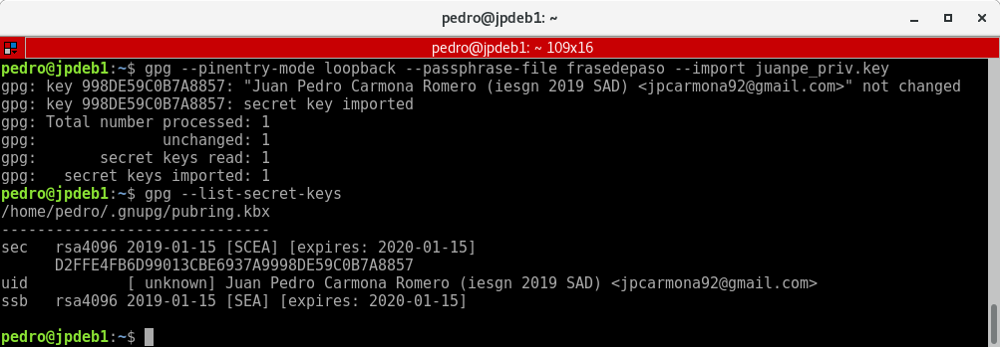
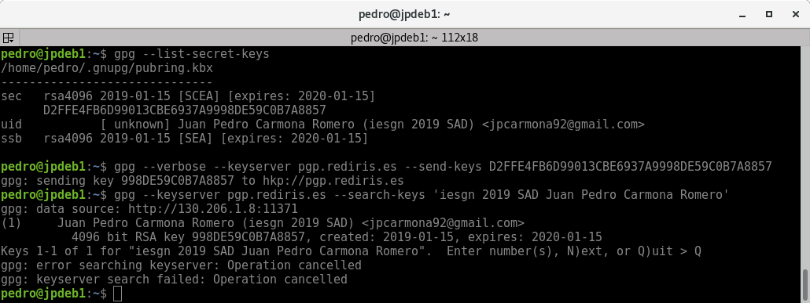
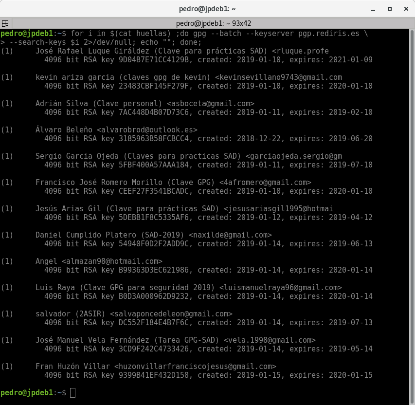
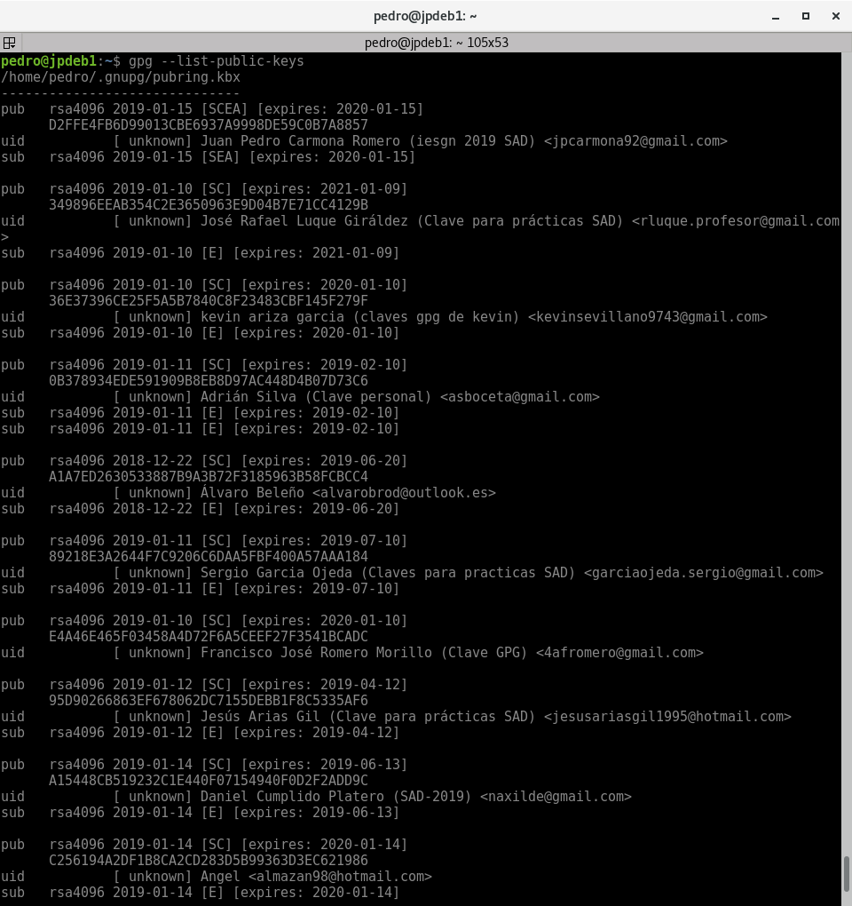
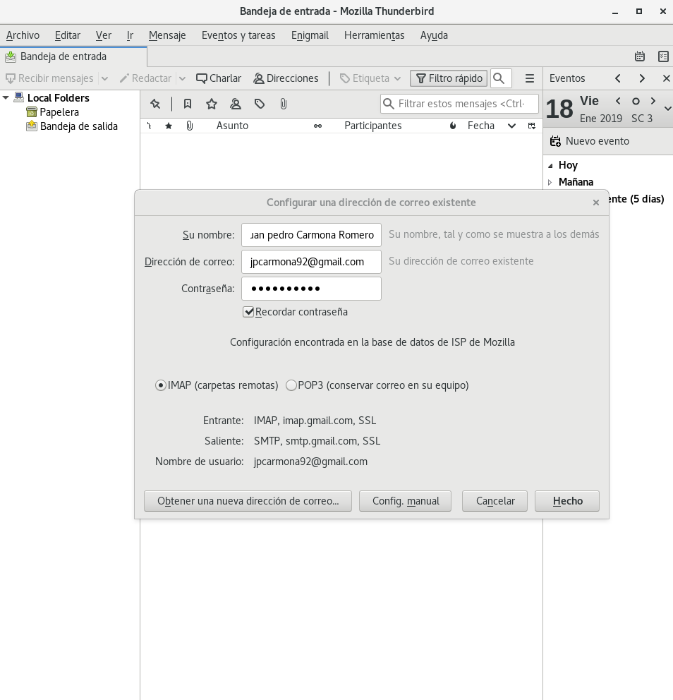
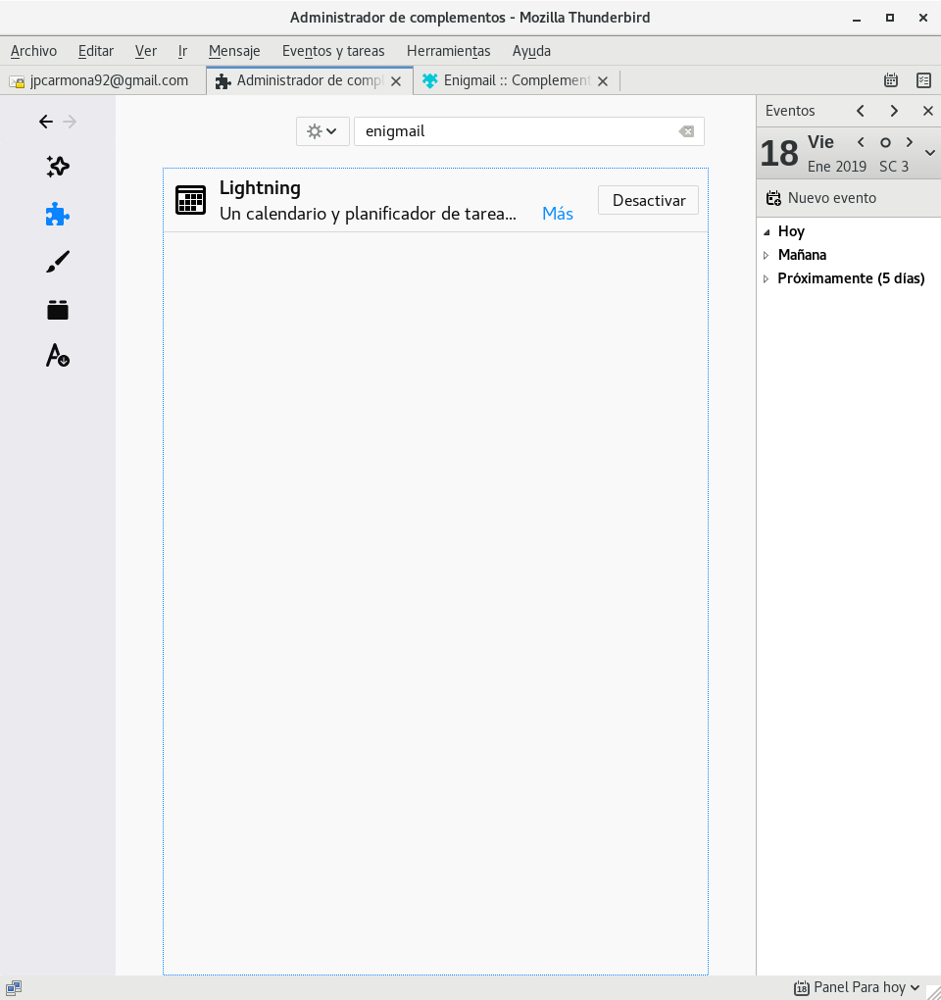
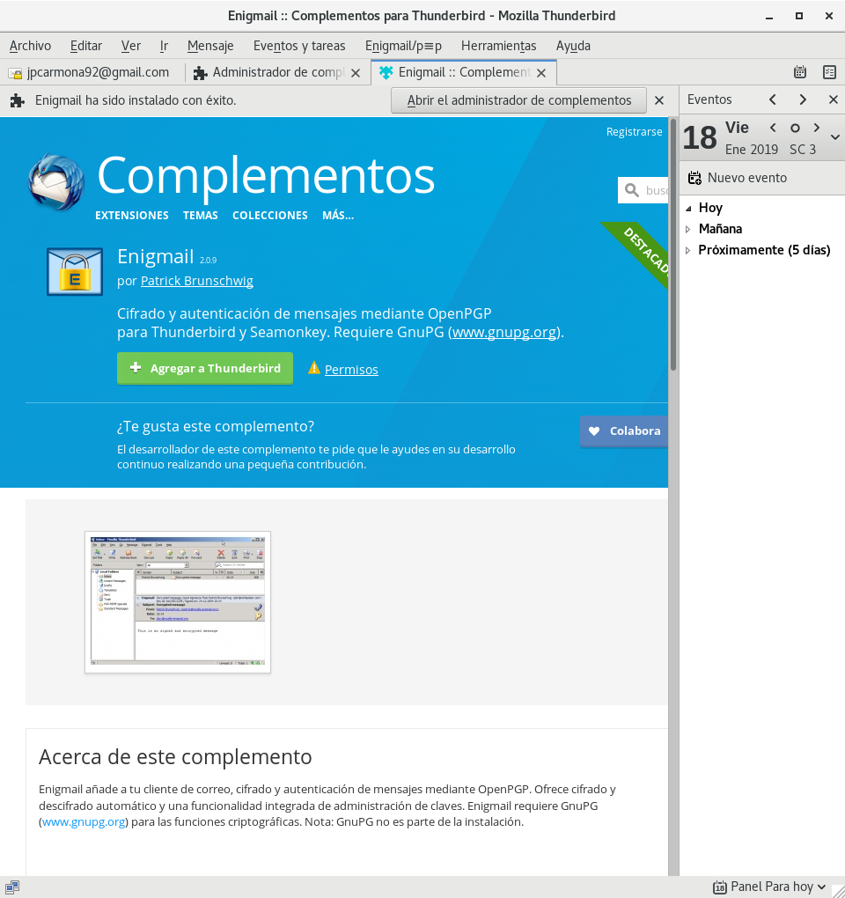
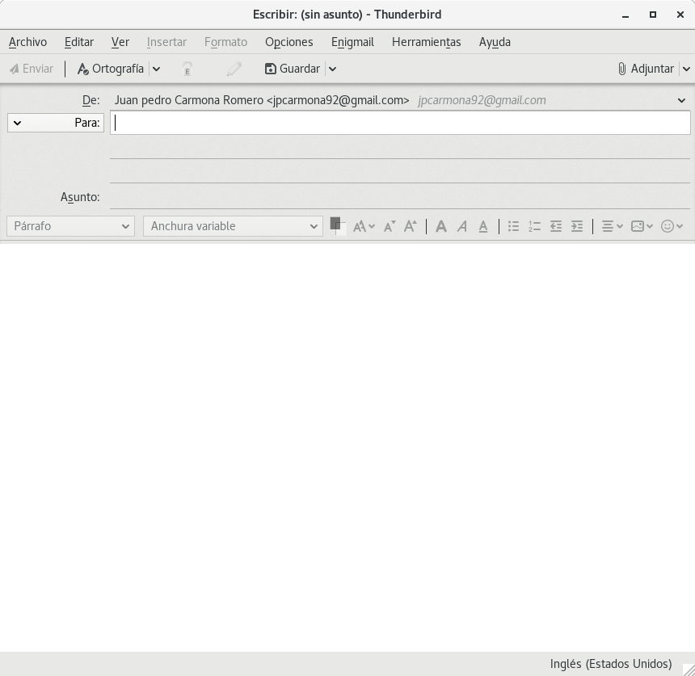
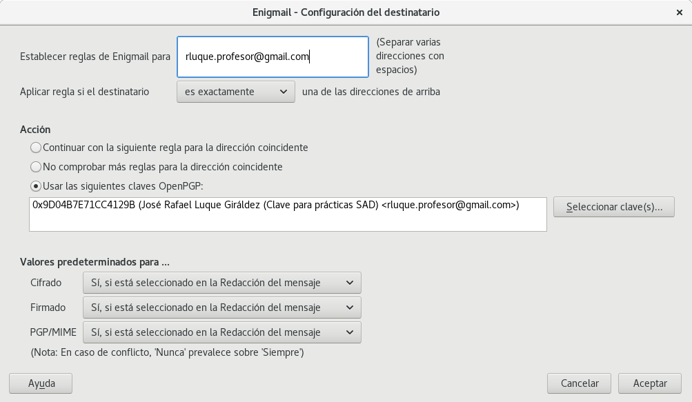
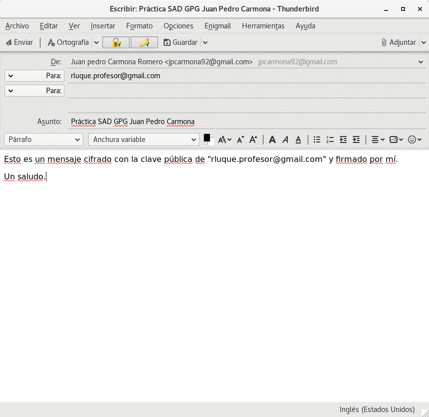

# Cifrado y firmas con GPG

<hr class="h3">

GPG (GNU Privacy Guard), que es un derivado libre de PGP, es una herramienta de seguridad en comunicaciones electrónicas y su utilidad es la de cifrar y firmar digitalmente, siendo además multiplataforma.

GPG utiliza criptografía de clave pública para que los usuarios puedan comunicarse de un modo seguro. En un sistema de claves públicas cada usuario posee un par de claves, compuesto por una “clave privada” y una “clave pública”. Cada usuario debe mantener su clave privada secreta; no debe ser revelada nunca. La clave pública se puede entregar a cualquier persona con la que el usuario desee comunicarse.

En esta entrada veremos como generar un par de claves y trabajar con ellas, además de usar un servidor de claves para subir y descargar claves públicas. También utilizaremos el cifrado y las firmas para enviar correos tanto en un sistema Linux(Debian) como en Windows.

<hr class="h3">

## Generación, exportación e importación de claves

### Creación par de claves desatendido

* Primero establecemos un directorio temporal para la creación de claves:
``` bash
export GNUPGHOME="$(mktemp -d)"
```

* Creamos un fichero con la frase de paso para no exponerlo mas tarde en la generación en claro:
``` bash
cat << EOF > frasedepaso
frasedepaso
EOF
```

!!! note ""
	Obviamente esta no será mi frase de paso.

* Creamos fichero de configuración de GPG:
``` bash
cat << EOF > key_conf
	Key-Type: RSA
	Key-Length: 4096
	Subkey-Type: RSA
	Subkey-Length: 4096
	Name-Real: Juan Pedro Carmona Romero
	Name-Comment: iesgn 2019 SAD
	Name-Email: jpcarmona92@gmail.com
	Expire-Date: 365
EOF
```

!!! note ""
	Los párametros de configuración son bastantes intuitivos, así que no los voy a explicar, pero podemos ver el manual de creación de claves desatendido en [GNUGPG-manual](https://www.gnupg.org/documentation/manuals/gnupg/Unattended-GPG-key-generation.html#Unattended-GPG-key-generation).

* Creación par de claves:
``` bash
time gpg --verbose --batch --pinentry-mode loopback --passphrase-file frasedepaso --generate-key key_conf
```

!!! note ""
	Utilizamos la opción `--batch` para generar la clave de forma desatendida mediante el fichero `key_conf` y la opción `--pinentry-mode loopback --passphrase-file frasedepaso` es para especificar la frase de paso mediante un fichero.


Podemos ver que he utilizado `time` para enseñaros lo que tarda en generarse y os puede parecer raro que haya tardado solo 6 segundos ya que esto suele tardar varios minutos. La clave está en la generación de entropía que necesita GPG para la generación de claves. Esto lo explico a continuación.

<hr class="h3">

### Generación de datos aleatorios para una fuente de entropía

* Instalación de paquete:
``` bash
apt install rng-tools
```

* Ejecución del demonio:
``` bash
rngd -r /dev/urandom
```

!!! note ""
	Una vez ejecutado el demonio no hará falta ejecutarlo más si vamos a generar varias claves.

<hr class="h3">

### Exportación de clave a fichero

* Listamos las claves:
``` bash
gpg --list-secret-keys
```

* Exportación de clave a un fichero:
``` bash
gpg --pinentry-mode loopback --passphrase-file frasedepaso \
--armor --export-secret-keys 'iesgn 2019 SAD' > juanpe_priv.key
```

!!! note ""
	* `--armor` : por defecto gpg exporta en binaro, de esta manera se exportará en texto plano.
	* `--export-secret-keys 'iesgn 2019 SAD'` : podemos utilizar como identificador para exportar la clave la huella, el nombre, el comentario o el email.


<hr class="h3">

### Importación de clave desde fichero

Ahora si queremos mantener el par de claves en la base de datos(anillo de claves) de GPG personal de un usuario realizaremos lo siguiente:

* Importamos la clave desde un fichero:
``` bash
gpg --pinentry-mode loopback --passphrase-file frasedepaso --import juanpe_priv.key
```

!!! attention "Atención"
	* Utilizar otro terminal para que utilize como "GNUPGHOME" el de nuestro usuario y no el temporal que creamos anteriormente.
	* Si por casualidad hemos borrado por error el directorio `.gnupg` necesitamos reiniciar el agente de GPG, podemos hacerlo reiniciando la máquina o ejecutando `gpgconf --kill gpg-agent`.



<hr class="h2">

## Servidores de claves públicas

!!! note ""
	En este apartado tendremos que tener un poco de paciencia, ya que estos servidores no responden con buena fluidez.

### Exportación de clave a un servidor

* Añadiremos nuestra clave pública al servidor `pgp.rediris.es`:
``` bash
gpg --verbose --keyserver pgp.rediris.es --send-keys D2FFE4FB6D99013CBE6937A9998DE59C0B7A8857
```

!!! note ""
	Tenemos que utilizar como identificador la huella de la clave.

* Podemos ver que se ha subido:
``` bash
gpg --keyserver pgp.rediris.es --search-keys 'iesgn 2019 SAD Juan Pedro Carmona Romero'
```



<hr class="h3">

### Revocar nuestra clave en el servidor

* Creamos clave de revocación:
``` bash
gpg --pinentry-mode loopback --passphrase-file frasedepaso --gen-revoke jpcarmona92@gmail.com > revocacion.txt
```

!!! note ""
	Nos preguntará de si estamos seguros de revocar la clave y la razón.

* Añadimos la clave de revocación a la base de datos(anillo de claves) de GPG temporal:
``` bash
export GNUPGHOME="$(mktemp -d)"
gpg --pinentry-mode loopback --passphrase-file frasedepaso --import juanpe_priv.key
gpg --import revocacion.txt
```

!!! note ""
	Lo hacemos de esta manera si no queremos revocar localmente nuestra clave.

* Enviamos revocación al servidor:
``` bash
gpg --verbose --keyserver pgp.rediris.es --send-keys D2FFE4FB6D99013CBE6937A9998DE59C0B7A8857
```

<hr class="h3">

### Importación de claves públicas del servidor

* Teniendo un fichero con las huellas de las claves que vamos a importarº:
``` bash
cat << EOF > huellas
1CC4129B
145F279F
B07D73C6
58FCBCC4
57AAA184
541BCADC
C5335AF6
2F2ADD9C
EC621986
962D9232
4E4B7F6C
C4733426
F432D158
EOF
```

* Podemos buscarlas para verificar que son las que necesitamos:
``` bash
for i in $(cat huellas) ;do gpg --batch --keyserver pgp.rediris.es \
--search-keys $i 2>/dev/null; echo ""; done;
```



* Importaremos estas claves públicas a nuestro anillo de claves de GPG:
``` bash
for i in $(cat huellas) ;do gpg --batch --keyserver pgp.rediris.es --recv-keys $i ; done;
```



<hr class="h2">

## Firma de claves

* Firma de claves públicas:
``` bash
for clave in $(cat huellas) ;do gpg --batch --pinentry-mode loopback --yes \
--passphrase-file frasedepaso --sign-key $clave ; done;
```

* Subimos las claves públicas firmadas al servidor:
``` bash
for i in $(cat huellas) ;do gpg --keyserver pgp.rediris.es --send-keys $i ; done;
```

<hr class="h2">

## Envío de correos cifrados y firmados con Mutt

Para el envío de correos voy a utilizar mutt, un agente de correo por línea de comandos.

### Cifrado y firma con GPG

* Lo primero que haremos será escribir el mensaje del correo:
``` bash
echo "Esto es el mensaje" > mensaje.txt
```

* Ahora procedemos a encryptar y firmar el mensaje:
``` bash
cat mensaje.txt | gpg --batch --pinentry-mode loopback --passphrase-file frasedepaso \
--encrypt --sign --armor --local-user "iesgn 2019 SAD" --recipient "rluque.profesor@gmail.com" \
> mensajecifrado.txt
```

!!! note ""
	* `--local-user` : Es el identificador de la clave privada que usaremos para firmar.
	* La contraseña que utilizamos para la frase de paso es la de la clave privada que utilizamos con la opción `--local-user`.
	* `--recipient` : Es el identificador de la clave pública que usaremos para cifrar.

<hr class="h3">

### Configuración y envío de correo con Mutt

* Configuración Mutt:
``` bash
cat << EOF > .muttrc
set from = "jpcarmona92@gmail.com"
set realname = "Juan Pedro Carmona"

set smtp_url = "smtps://jpcarmona92@gmail.com@smtp.gmail.com:465/"
set smtp_pass = "contraseña"
EOF
```

!!! note ""
	* `from` : Es la cuenta del correo que enviará los correos.
	* `realname` : Es el nombre del emisor.
	* `smtp_url` : Es el servidor smtp que utilizaremos.
	* `smtp_pass` : Es la contraseña de la cuenta de correo emisora.

* Envío de correo con Mutt:
``` bash
cat mensajecifrado.txt | mutt -s "Esto es el asunto" rluque.profesor@gmail.com
```

!!! attention "Atención"
	Para enviar correos desde cualquier aplicación con el servidor smtp de gmail, tendremos que configurar en nuestra cuenta de Google, que permitimos el uso de aplicaciones no seguras.
	[Tutorial de Google](https://support.google.com/accounts/answer/6010255?hl=es).

<hr class="h2">

## Envío de correos cifrados y firmados con Thunderbird

* Instalamos Thunderbird:
``` bash
apt install thunderbird thunderbird-l10n-es-es
```

### Añadir cuenta de correo a Thunderbird

En el menú --> Archivo --> Nuevo --> Cuenta de correo existente...
Rellenamos los campos que aparecen.



<hr class="h3">

### Instalación complemento Enigmail

En el menú --> Herramientas --> Complementos
Buscamos Enigmail y lo agrefamos a Thunderbird.





<hr class="h3">

### Envío de correo cifrado y firmado

En el menú --> Nuevo --> Mensaje



* Para seleccionar la clave privada con la que firmar:

En el menú --> Enigmail --> Preferencias --> Opciones de firmado/cifrado...

Habilitamos soporte OpenGPG. Usamos un identificador de claves especifico y seleccionamos clave.


* Para cifrar el mensaje:

Por defecto si tenemos una clave pública añadido a nuestro anillo de claves GPG con el correo del destinatario, se cifrará con esa clave pública. Pero si queremo elegir otra realizamos lo siguiente:

En el menú --> Enigmail --> Preferencias --> Editar reglas por-destinatario.

Añadimos una nueva. Establecemos el correo de destinatario. Seleccionamos la clave a usar para el cifrado.




Luego para activar el cifrado y la firma del mensaje:

En el menú --> Enigmail --> Cifrar Mensaje

En el menú --> Enigmail --> Firmar Mensaje

Y listo ya podemos proceder a escribir el asunto, el mensaje y enviarlo.



!!! note ""
	Cuando envíemos el mensaje nos pedirá la frase de paso de nuestra clave privada para la firma.

<hr class="h2">

## Envío de correos cifrados y firmados en Windows