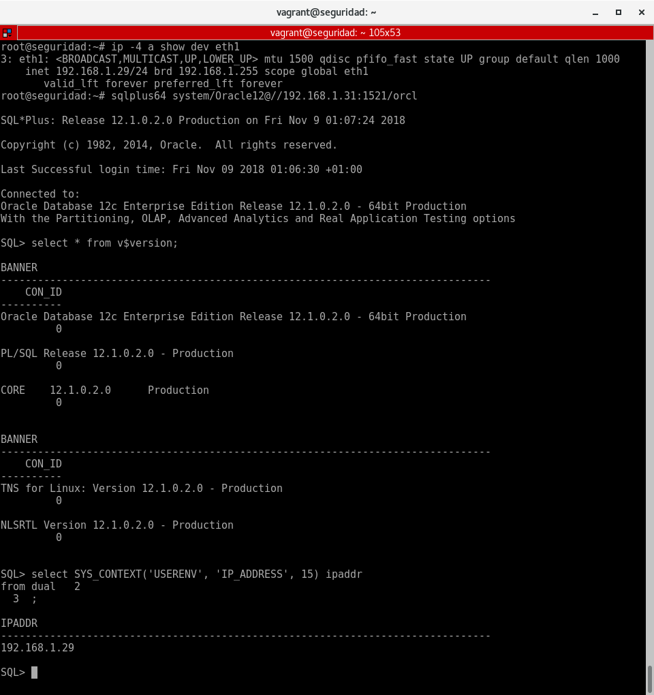

# MkDocs

En este post veremos como crear páginas estáticas con MkDocs en un entorno Debian Stretch y luego desplegarlas con GitHubPages .

## Instalación

Antes de instalar algo en Entornos Debian:  
``` bash
sudo apt update
```

Instalamos Python y Pip ya que MkDocs está desarrollado en Python:
``` bash
sudo apt-get install python3.5
sudo apt-get install python3-pip
```

Instalamos el creador de entornos virtuales de Python para instalar los modulos necesarios en nuestro entorno:
``` bash
sudo apt-get install python3-venv
```

Creamos el entorno:  
``` bash
python3 -m venv mkdocs_env
```

Activamos el entorno:  
``` bash
source mkdocs_env/bin/activate
```

Instalamos el generador de páginas estáticas MkDocs:
``` bash
pip install mkdocs
```

Instalamos también una plantilla para nuestro sitio:
``` bash
pip install mkdocs-material
```

## Creación del sitio

Para empezar generamos un sitio estándar:
``` bash
mkdocs new sitio1
cd sitio1
```

La configuración se realiza en el fihero 


Para más documentación visita:  
[mkdocs.org](https://www.mkdocs.org)  
[pages.github.com](https://help.github.com/categories/github-pages-basics)  


De esta forma podrías insertar una imagen
![nombre de la imagen][img1]

O dos, sin ensuciar tu espacio de escritura.
![nombre de la imagen2][img2] 

[img1]: /ruta/a/la/imagen.jpg "Título alternativo"
[img2]: /ruta/a/la/imagen2.jpg "Título alternativo"

